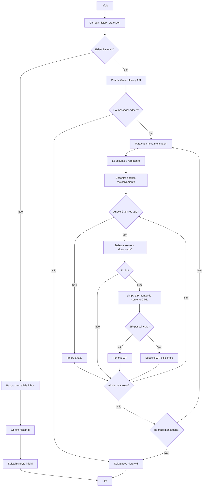

# GmailAPI - Download de anexos XML/ZIP com Gmail History API

## Visão geral
Este projeto monitora novos e-mails da conta Gmail usando `historyId` e baixa anexos com extensão `.xml` e `.zip`.

Quando encontra um arquivo `.zip`, ele:
- abre o ZIP;
- mantém apenas arquivos `.xml` internos;
- remove os demais arquivos;
- descarta o ZIP inteiro caso não exista XML dentro.

O estado de processamento é salvo em `history_state.json`, permitindo continuar da última execução.

---

## Como funciona (fluxo)


1. Carrega `history_state.json`.
2. Se não existir `historyId`, busca um e-mail da inbox e salva o `historyId` inicial.
3. Se já existir `historyId`, chama `gmail.users.history.list` para eventos novos.
4. Para cada mensagem adicionada (`messagesAdded`):
   - lê assunto/remetente;
   - localiza anexos de forma recursiva (`payload.parts`);
   - baixa apenas `.xml` ou `.zip` para a pasta `downloads/`.
5. Se o anexo for ZIP, limpa o conteúdo mantendo apenas XML.
6. Ao final, salva o novo `historyId`.

---

## Estrutura principal
- `main.js`: fluxo principal (Gmail API, histórico, download e filtro de anexos).
- `utils.js`: persistência de estado e limpeza de arquivos ZIP.
- `history_state.json`: último `historyId` + data da última execução.
- `downloads/`: pasta onde os anexos são salvos.
- `testes/`: scripts auxiliares de teste.

---

## Pré-requisitos
- Node.js 18+ (recomendado).
- Projeto OAuth2 no Google Cloud com Gmail API habilitada.
- `refresh_token` válido da conta Gmail.

---

## Instalação
No diretório do projeto:

```bash
npm install googleapis dotenv adm-zip
```

> Se ainda não existir `package.json`, rode antes:
>
> ```bash
> npm init -y
> ```

---

## Configuração (`.env`)
Crie um arquivo `.env` na raiz do projeto com:

```env
CLIENT_ID=seu_client_id
CLIENT_SECRET=seu_client_secret
REFRESH_TOKEN=seu_refresh_token
```

### Escopo necessário
O token OAuth precisa permitir leitura de e-mails (por exemplo, `https://www.googleapis.com/auth/gmail.readonly`).

---

## Execução
```bash
node main.js
```

### Primeira execução
- O sistema salva apenas o `historyId` inicial e encerra.

### Próximas execuções
- O sistema usa o `historyId` salvo para processar somente novidades.

---

## Regras de anexos
### XML (`.xml`)
- É baixado diretamente para `downloads/`.

### ZIP (`.zip`)
- É baixado para `downloads/`.
- Um ZIP “limpo” é criado contendo apenas arquivos `.xml` internos.
- Se não houver XML dentro do ZIP, o arquivo é removido.

---

## Logs esperados
Exemplos de logs durante a execução:
- `HistoryId atual: ...`
- `Novo email detectado: ...`
- `Arquivo salvo: ...`
- `Zip descartado (sem XML)`
- `Zip substituído pelo limpo`

---

## Troubleshooting
- **`invalid_grant` / token inválido**
  - Gere novo `refresh_token` e atualize o `.env`.

- **Sem novos e-mails processados**
  - Verifique se o `historyId` não está muito antigo/inválido.
  - Apague `history_state.json` para forçar nova inicialização.

- **Erro de permissão na pasta `downloads/`**
  - Verifique permissões de escrita no diretório do projeto.

---

## Próximas melhorias sugeridas
- Rodar em intervalo automático (cron/agendador).
- Filtrar por remetente/assunto antes de baixar anexos.
- Evitar sobrescrita quando anexos tiverem mesmo nome.
- Adicionar testes automatizados para `utils.js`.
