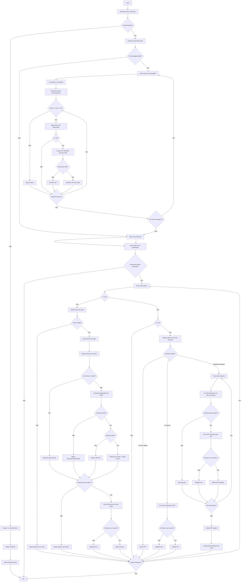

# GmailAPI - Monitoramento Gmail + validação de XML (NFe) por CNPJ

## Visão geral
Este projeto monitora novos e-mails da conta Gmail usando `historyId`, baixa anexos com extensão `.xml` e `.zip`, e processa XMLs de NFe/NFCe para validar empresa ativa por CNPJ. Após validação bem-sucedida, os arquivos são automaticamente enviados para uma API externa.

Quando encontra um arquivo `.zip`, ele:
- abre o ZIP;
- mantém apenas arquivos `.xml` internos;
- remove os demais arquivos;
- descarta o ZIP inteiro caso não exista XML dentro;
- agrupa XMLs por empresa (CNPJ) para envio separado quando necessário.

O estado de processamento é salvo em `history_state.json`, permitindo continuar da última execução.

Após buscar novos anexos, os XMLs da pasta `downloads/` são processados para:
- extrair a chave de acesso (44 dígitos) do nome do arquivo;
- extrair o CNPJ da chave;
- consultar empresa no cache (JSON/memória) e, se necessário, no PostgreSQL;
- identificar se a empresa está ativa, inativa ou não encontrada;
- enviar o arquivo para a API usando o token de integração da empresa;
- deletar o arquivo após envio bem-sucedido.

---

## Como funciona (fluxo)


1. Carrega `history_state.json`.
2. Se não existir `historyId`, busca um e-mail da inbox e salva o `historyId` inicial.
3. Se já existir `historyId`, chama `gmail.users.history.list` para eventos novos.
4. Para cada mensagem adicionada (`messagesAdded`):
   - lê assunto/remetente;
   - localiza anexos de forma recursiva (`payload.parts`);
   - baixa apenas `.xml` ou `.zip` para a pasta `downloads/`.
5. Se o anexo for ZIP, limpa o conteúdo mantendo apenas XML.
6. Salva o novo `historyId`.
7. Processa todos os XMLs em `downloads/`:
   - extrai chave e CNPJ a partir do nome do arquivo;
   - valida formato da chave;
   - consulta cache de empresas (`empresas_cache.json` + memória);
   - em cache miss, consulta `dbo.empresas_tbl` no banco;
   - registra no log se empresa está `ATIVA`, `INATIVA` ou `NAO_ENCONTRADA`.

---

## Atualizações recentes
- Integração de validação de XML por chave de acesso da NFe.
- Extração de CNPJ direto da chave (posições 7 a 20 da chave de 44 dígitos).
- Implementação de cache híbrido de empresas:
  - memória (`cacheMemoria`);
  - arquivo local `empresas_cache.json`;
  - recarga automática do PostgreSQL quando cache expira.
- Fallback de consulta no banco para CNPJ não encontrado no cache.
- Inclusão de token de integração (`integration_api_token`) no objeto de empresa retornado.
- **[NOVO]** Envio automático de XMLs validados para API externa após processamento.
- **[NOVO]** Deleção automática de arquivos após envio bem-sucedido.
- **[NOVO]** Processamento inteligente de ZIPs com múltiplas empresas:
  - Agrupamento de XMLs por CNPJ.
  - Criação de ZIPs separados por empresa.
  - Envio paralelo para diferentes APIs conforme token da empresa.

---

## Estrutura principal
- `main.js`: fluxo principal (Gmail API, histórico, download, limpeza de ZIP e processamento de XML).
- `utils.js`: persistência de estado, limpeza de ZIP e utilitários de chave/CNPJ.
- `empresaCache.js`: gerenciamento de cache de empresas e consulta por CNPJ.
- `db.js`: conexão PostgreSQL e executor de queries.
- `empresas_cache.json`: snapshot do cache de empresas (persistência local).
- `history_state.json`: último `historyId` + data da última execução.
- `downloads/`: pasta onde os anexos são salvos.
- `testes/`: scripts auxiliares de teste.

---

## Pré-requisitos
- Node.js 18+ (recomendado).
- Projeto OAuth2 no Google Cloud com Gmail API habilitada.
- `refresh_token` válido da conta Gmail.
- PostgreSQL acessível com tabela `dbo.empresas_tbl`.

---

## Instalação
No diretório do projeto:

```bash
npm install googleapis dotenv adm-zip pg axios form-data
```

> Se ainda não existir `package.json`, rode antes:
>
> ```bash
> npm init -y
> ```

---

## Configuração (`.env`)
Crie um arquivo `.env` na raiz do projeto com:

```env
CLIENT_ID=seu_client_id
CLIENT_SECRET=seu_client_secret
REFRESH_TOKEN=seu_refresh_token

DB_HOST=localhost
DB_PORT=5432
DB_NAME=seu_banco
DB_USER=postgres
DB_PASSWORD=sua_senha
```

### Escopo necessário
O token OAuth precisa permitir leitura de e-mails (por exemplo, `https://www.googleapis.com/auth/gmail.readonly`).

---

## Integração com API de Upload
O sistema envia arquivos XML/ZIP validados para uma API externa através de requisição `POST` com `multipart/form-data`.

### Requisição
- **URL**: `http://localhost:3000/upload`
- **Método**: `POST`
- **Headers**: 
  - `Authorization: Bearer {integration_api_token}`
  - Form data com arquivo
- **Body**: Multi-part form data com chave `file` contendo o arquivo (XML ou ZIP)
- **Timeout**: 30 segundos

### Resposta esperada
- **Sucesso (2xx)**: JSON com resultado do processamento
- **Falha**: Erro é registrado em log e o arquivo é **mantido** para reprocessamento posterior

---
```bash
node main.js
```

### Primeira execução
- O sistema salva apenas o `historyId` inicial e encerra.

### Próximas execuções
- O sistema usa o `historyId` salvo para processar somente novidades.

---


## Regras de processamento de XML
- A chave da NFe é extraída do nome do arquivo via regex (`\d{44}`).
- Arquivo sem chave válida é ignorado com log de aviso.
- O CNPJ é extraído da chave e consultado no cache/banco.
- Resultados possíveis:
  - `ATIVA`: empresa encontrada e ativa;
  - `INATIVA`: empresa encontrada, porém inativa;
  - `NAO_ENCONTRADA`: empresa não localizada no banco.
- Se empresa estiver `INATIVA` ou `NAO_ENCONTRADA`, o arquivo é ignorado.
- Se empresa estiver `ATIVA`, **o arquivo é enviado para a API** usando o `integration_api_token`.
- Se não houver `integration_api_token`, o arquivo é ignorado com aviso.
- Após envio bem-sucedido para a API, o arquivo é **automaticamente deletado** da pasta `downloads/`.

## Regras de processamento de ZIP
- Se contiver XMLs de **uma única empresa**: o ZIP é enviado inteiro para a API, depois deletado.
- Se contiver XMLs de **múltiplas empresas**: 
  - Um ZIP separado é criado para cada empresa (pasta `temp_zips/`).
  - Cada ZIP separado é enviado para sua respectiva empresa.
  - ZIPs separados são deletados após envio.
  - ZIP original é deletado após processar todos os grupos.
  - Pasta `temp_zips/` é removida se vazia.
- Se não contiver XMLs válidos, o ZIP é ignorado.

---

## Logs esperados
Exemplos de logs durante a execução:
- `HistoryId atual: ...`
- `Novo email detectado: ...`
- `Arquivo salvo: ...`
- `📦 Analisando ZIP: ... | Total de arquivos: X | XML encontrados: Y | Descartados: Z`
- `Zip descartado (sem XML)`
- `Zip limpo criado`
- `Zip substituído pelo limpo`
- `✅ Empresa encontrada | CNPJ: ... | Chave: ...`
- `⚠️ Empresa sem token | CNPJ: ... | id_empresa: ...`
- `❌ Empresa não encontrada | CNPJ: ... | Chave: ...`
- `🚀 XML enviado com sucesso | Arquivo: ...`
- `ZIP original enviado: ...`
- `ZIP separado enviado: ...`
- `🗑️ Arquivo removido: ...`
- `🗑️ ZIP removido: ...`
- `🗑️ ZIP temporário removido: ...`
- `🗑️ ZIP original removido: ...`
- `🗑️ Pasta temp_zips removida (vazia)`
- `📦 Cache carregado do JSON`
- `🔄 Cache ausente ou expirado. Recarregando do banco...`

---

## Troubleshooting
- **`invalid_grant` / token inválido**
  - Gere novo `refresh_token` e atualize o `.env`.

- **Sem novos e-mails processados**
  - Verifique se o `historyId` não está muito antigo/inválido.
  - Apague `history_state.json` para forçar nova inicialização.

- **Erro de permissão na pasta `downloads/`**
  - Verifique permissões de escrita no diretório do projeto.

- **Erro de conexão com PostgreSQL**
  - Revise variáveis `DB_*` no `.env`.
  - Valide se o banco está ativo e acessível.

- **Empresa sempre não encontrada**
  - Confirme se o CNPJ extraído existe em `dbo.empresas_tbl`.
  - Verifique se o campo `cnpj` no banco contém o mesmo formato esperado.

---

## Próximas melhorias sugeridas
- Rodar em intervalo automático (cron/agendador).
- Filtrar por remetente/assunto antes de baixar anexos.
- Evitar sobrescrita quando anexos tiverem mesmo nome.
- Implementar retry automático para envios falhados.
- Mover XML/ZIP para pasta de sucesso/erro após processamento.
- Adicionar testes automatizados para `utils.js` e `empresaCache.js`.
- Gerar relatório de processamento (quantidade enviada, erros, etc).
- Implementar validação de XML antes do envio (schema validation).
